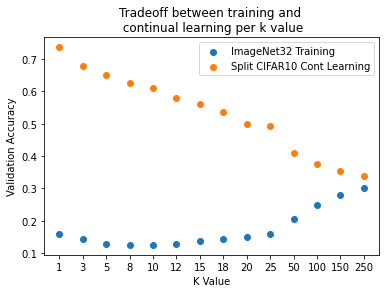
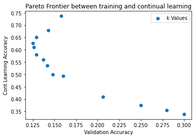

# SDMLP: Sparse Distributed Memory Multi-Layer Perceptron for Continual Learning

## Description
This repository contains the implementation of the **SDMLP (Sparse Distributed Memory Multi-Layer Perceptron)** architecture, inspired by the paper **"Sparse Distributed Memory is a Continual Learner"**. This model is designed for continual learning tasks and incorporates several novel features:
- **Top-K Activation**: Activates only the top-K neurons during learning, preventing catastrophic forgetting.
- **GABA Switch Mechanism**: Excites all neurons early in training to prevent dead neurons, allowing all neurons to participate initially.
- **Momentum-Free Optimization**: Ensures that inactive neurons are not wrongly updated by eliminating the use of momentum in optimization.
-K Value Frontier
The model has been tested on CIFAR-10 datasets in a class-incremental learning setup.

---
# Training vs Continual Learning Tradeoff Analysis- KValueFrontier.ipynb

## Overview
These notebook's graphs demonstrate a fundamental tradeoff in machine learning systems between initial training performance and continual learning capabilities. The analysis uses different k-values to explore how model architectures balance these competing objectives.

## Key Insights:
The first graph shows a clear inverse relationship between **ImageNet32 training accuracy** and **Split CIFAR10 continual learning performance** across various k-values (ranging from 1 to 250). As k-values increase, continual learning performance deteriorates while initial training accuracy shows modest improvements. This indicates that architectural choices optimizing for traditional training metrics may impair a model's ability to learn new tasks over time.

## Pareto Analysis
The second graph presents a **Pareto frontier** of achievable performance combinations between training and continual learning metrics. The frontier's shape confirms that it's impossible to simultaneously maximize both objectives - improvements in one metric necessarily come at the cost of the other. This relationship appears to be fundamental rather than an artifact of current training methods.

## Implications
These findings have significant implications for designing ML systems that need to maintain plasticity while preserving performance on original tasks. We must carefully choose k-values based on their specific requirements:
- **Lower k-values**: Favor continual learning capability
- **Higher k-values**: Prioritize initial training performance

This tradeoff should inform architectural decisions in scenarios where both initial performance and adaptability are important considerations.
---
# Optimizer Behavior Analysis - StaleGradient.ipynb (All graphs with respective titles are explained here)

This analyzes the behaviour of SGDM, Adam, and RMSprop under stale gradients and sparse updates.

## Key Findings

### Gradient Delta Analysis
- **RMSprop** has the largest deviation (~7x) from true gradients, while **SGDM** has the smallest (<0.5x).
- Deviation increases with longer update intervals.

### Optimizer Comparison
- **RMSprop-SGDM** shows the largest pairwise difference.
- **Adam-SGDM** difference is moderate.
- All deltas are positive, indicating systematic bias.

### Momentum Characteristics
- **RMSprop** has the highest momentum squared values.
- **Adam** shows moderate momentum with bias correction.
- Momentum correlates with gradient spikes.

### Gradient Spike Analysis
- **RMSprop** exhibits the largest spikes (~10x baseline), **Adam** shows moderate spikes (~1.5x), and **SGDM** is most stable (~0.5x).
- Spike magnitudes increase with longer update intervals.

### Decay Behavior
- **RMSprop** decays the fastest, **Adam** has a moderate decay rate, and **SGDM** is the most stable.
- All optimizers converge to near-zero over time.

More analysis shows :

1. **Log10 Delta Between Optimizer and Actual Gradient**:  
   - **RMSprop** has the highest deviation (~10¹), **Adam** is moderate (~10⁰), and **SGDM** shows decreasing deviation (from 10⁻¹ to 10⁻⁴), indicating superior stability with stale gradients.

2. **Gradient Spikes Comparison**:  
   - **RMSprop** shows the highest spikes (~10 units), **Adam** is moderate (~1.5 units), and **SGDM** remains most stable (~0.5 units).

3. **Decay Behavior**:  
   - **RMSprop** decays rapidly, **Adam** has smoother decay, and **SGDM** shows the most controlled behavior. All optimizers eventually converge to near-zero.

## Parameter Sensitivity
- **Learning Rate (α)**: Higher rates lead to larger spikes and faster convergence; lower rates provide more stable updates.
- **Momentum (β)**: Higher values smooth decay and prolong memory; lower values result in quicker responses to new gradients.
- **Epsilon (ε)**: Critical for numerical stability in adaptive methods (Adam, RMSprop).

## Key Insights:
- **SGDM** is the most stable with stale gradients, while **RMSprop** and **Adam** show more volatility.
- Longer update intervals increase deviations and spikes.
- Parameter tuning (learning rate, momentum) significantly affects optimizer behaviour.

---

# Targeted_InvestigatingContinualLearning.ipynb explanation

This notebook investigates the behavior of neurons in the **Sparse Distributed Memory Multi-Layer Perceptron (SDMLP)** architecture during continual learning tasks. The main focus is understanding how **Top-K activation** and the **GABA switch mechanism** prevent catastrophic forgetting and address the dead neuron problem in the SDMLP model.

## Key Analyses:

1. **UMAP Visualization**:
   - Uses **UMAP embeddings** to visualize the distribution of **training data** and **neuron weights** in 2D space. This helps in understanding how neurons specialize and adapt as new tasks are learned.

2. **Neuron Activation and Sparsity**:
   - Tracks the percentage of neurons that remain **active** or "alive" across different tasks, providing insights into the model’s **sparsity** via the **Top-K activation function**.

3. **Neuron Entropy Calculation**:
   - Calculates **entropy** to measure the distribution of neuron activations, helping evaluate neuron specialization across tasks and ensuring that the **GABA switch** prevents neurons from becoming inactive.

4. **Model Comparisons**:
   - Compares the performance of different architectures, including **SDM**, **Top-K**, and **ReLU-based MLPs**, to highlight the advantages of **SDMLP** in continual learning. This includes generating activation histograms.

5. **Activation Histograms**:
   - Visualizes the frequency of neuron activations using **histograms** during different task splits to show how often neurons are selected and how **Top-K activation** impacts activation diversity compared to **ReLU**.

## Key Objectives:

- **Prevent Catastrophic Forgetting**: Monitor neuron sparsity and activation diversity to avoid the model forgetting previously learned tasks.
- **Effect of GABA Switch**: Investigate how the GABA switch ensures all neurons initially participate in learning.
- **Top-K Activation Benefits**: Demonstrate how Top-K activation helps maintain performance across multiple tasks.

## Key Insights:

- The **GABA switch mechanism** effectively prevents the **dead neuron problem** by exciting all neurons early in training.
- **Top-K activation** facilitates neuron specialization while reducing the risk of catastrophic forgetting.
- **SDM-based models** outperform traditional ReLU MLPs in maintaining performance during continual learning tasks.

---
# InvestigatingContinualLearningWeights.ipynb explanation

This notebook explores the behaviour of neurons in the **Sparse Distributed Memory Multi-Layer Perceptron (SDMLP)** architecture during continual learning. The key focus is to understand how **Top-K activation** and the **GABA switch mechanism** prevent catastrophic forgetting and ensure that neurons remain active throughout the learning process.

## Key Features

### 1. Neuron Activation and Sparsity:
- The notebook tracks **neuron activations** across different task splits to determine which neurons remain alive (active) as learning progresses. This analysis helps monitor neuron sparsity and specialization, key components in preventing **dead neurons**.

### 2. Weight Embeddings and UMAP Visualization:
- **UMAP embeddings** are used to visualize the distribution of training data and neuron weights. This allows for a deeper understanding of how neurons adapt to the data manifold over time, ensuring that the network avoids catastrophic forgetting.

### 3. Weight Specialization:
- The notebook tracks the evolution of neuron weights using **L2 norms** and **cosine similarity** metrics, showing how neurons specialize in response to new tasks. This is aligned with the **Top-K activation** and **L2 normalization** strategies discussed in the research paper.

### 4. Model Comparison:
- The notebook compares the performance of different architectures, including **SDM**, **Top-K**, and **ReLU-based MLPs**, showing how sparsity and neuron specialization help SDMLP models outperform traditional models in continual learning tasks.

### Key Insights:
- **Top-K Activation** and the **GABA switch** prevent the dead neuron problem and ensure neurons specialize across tasks.
- **Sparse Distributed Memory (SDM)** tiling of the data manifold allows for continual learning without catastrophic forgetting.
- **SDM-based models** outperform traditional ReLU-based models in retaining task performance across multiple learning stages.
  

